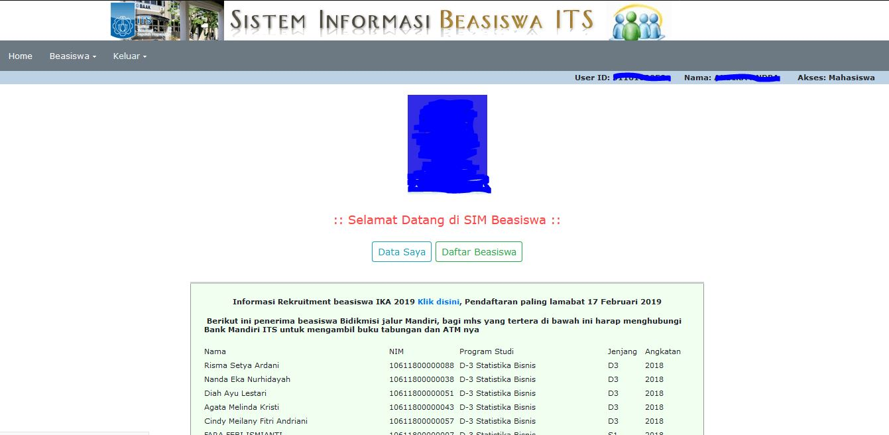
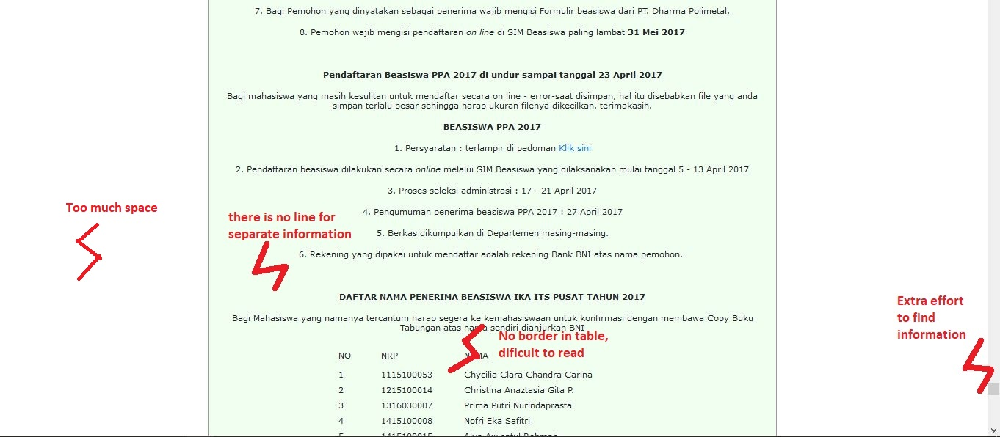
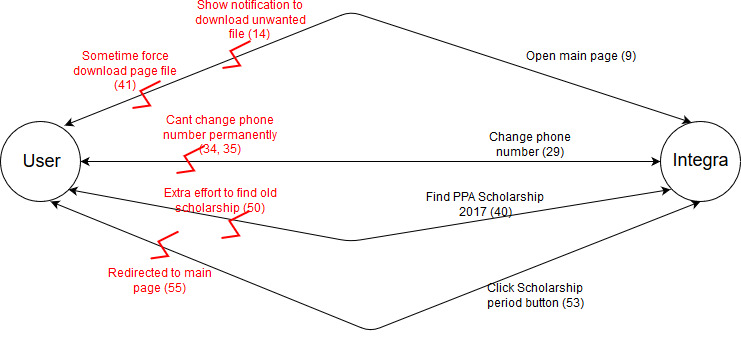
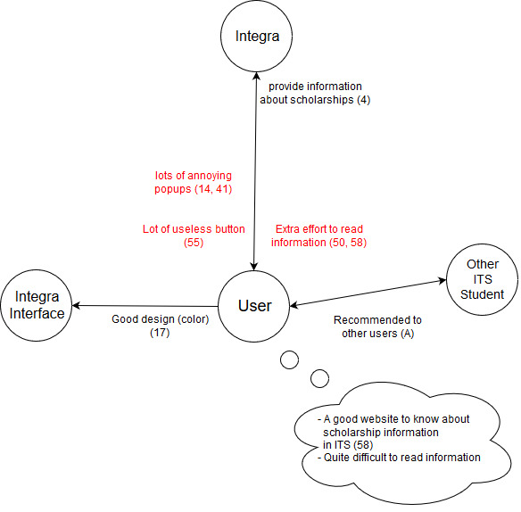

# Contextual Inquiry and Analysis

### Outline 
  - [Integra Description](#integra-scholarship-system-information-description)
  - [Instruction Script](#instruction-script)
  - [User Description](#user-description)
  - [Transcript](#transcript)
  - [Models and Annotations](#models-and-annotations)
      - [Artifact Model](#artifact-model)
      - [Flow Model](#flow-model)
      - [Cultural Model](#cultural-model)
  - [Do's and Don't's](#dos-and-donts)
<br>
## Integra Scholarship System Information Description

[Integra Scholarship System Information](https://integra.its.ac.id/) Description is part of integra which is a website that is used as a registration and information about scholarships for ITS students.
As a means to present information, the goal has been achieved, but there are several parts of the website that need to be repaired, some users have difficulty finding and reading about scholarship information, due to the absence of lines that separate the column to the table, the boundary between two tables until the notification appears to download an unwanted file.

<br>
## Instruction Script
  - Try to open main page of Integra Scholarship System Information
  - Try to change phone number while register scholarship
  - Find scholarship information from 2 years ago
  - Try to click the scholarship period button in database of scholarship menu

## User Description
  - The user is female 21 years old
  - The user is a student of Chemical Engineering in ITS
  - Her name is Wardha Savitri
  - She rarely using Integra Scholarship System Information
  - She has litle experience about this website

## Transcript
```text
  1. Andika   : Selama studi di ITS, pernahkah membuka SIM beasiswa di integra?
  2. Wardha   : Pernah, tapi sangat jarang sih
  3. Andika   : Apa tujuanmu mengakses SIM beasiswa?
  4. Wardha   : Biasanya untuk melihat info beasiswa
  5. Andika   : Kapan terakhir kamu membuka web tersebut?
  6. Wardha   : Sudah cukup lama, kira-kira semester lalu
  7. Andika   : Oke, sekarang coba login integra dulu
  8. Wardha   : Oke
  9. Andika   : Kalo udah, kamu masuk SIM beasiswa terus buka halaman awalnya
  10. Wardha  : Udah
  11. Andika  : Gimana first impressionmu ke web yang sekarang?
  12. Wardha  : Hmm
  13. (User mengamati beberapa saat)
  14. Wardha  : Pas aku pertama kali buka ada notif buat download file, yaudah aku download, pas aku buka filenya ternyata isinya pengumuman peneriman beasiswa ******* :grin:
  15. Andika  : Hehe iya aku juga gatau kenapa gitu
  16. Andika  : Oke lanjut, 
  17. Wardha  : Kalo dari segi tampilan sih sekarang lebih baik, jadi lebih berwarna
  18. Andika  : Iya, terus
  19. Wardha  : Tapi isi dari info beasiswa e ya sama aja kayak dulu, agak susah mbacanya 
  20. Andika  : Emang agak susah sih, gara-gara gaada pembatasnya kan?
  21. Wardha  : Iya dik
  22. Andika  : Pernah daftar beasiswa nggak?
  23. Wardha  : Pernah dulu
  24. Andika  : Coba sekarang daftar beasiswa lagi, isi data-datanya yang lengkap, ntar kalo udah bisa dihapus kok
  25. Wardha  : Oke aku coba dulu ya
  26. Andika  : Oke
  27. (Wardha mencoba mendaftar salah satu beasiswa)
  28. Wardha  : Udah
  29. Andika  : Coba kamu ganti nomor HP mu yang ada didatamu dengan no HP mu yang baru
  30. (Data nomor HP wardha di integra masih menggunakan nomor HP yang lama, sekarang mempunyai nomor HP yang baru)
  31. Andika  : Coba save
  32. Wardha  : Oke udah
  33. Andika  : Buka lagi datamu, terus cek nomor HP mu
  34. Wardha  : Nomornya kok masih sama kayak sebelumnya ya? hmm
  35. Andika  : Iya, itu bisa diedit tapi gabisa diganti emang
  36. Wardha  : Hm jadi percuma ya aku ganti-ganti
  37. Andika  : Ya begitulah :grin:
  38. Andika  : Oke lanjut yaa
  39. Wardha  : Oke
  40. Andika  : Terus coba kamu ke halaman awal, coba kamu cari penerima beasiswa PPA tahun 2017
  41. Wardha  : Ini pas aku buka kok muncul notif download file home.php ya?
  42. Andika  : Iya ta? aku cek dulu
  43. (Saya mengecek mengenai hal tersebut)
  44. Andika  : Aku kok gaada tapi ya, kayaknya ga mesti deh, cuma beberapa waktu aja yang gitu, coba aku lihat filenya
  45. (Setelah saya cek, ternyata file itu adalah file halaman tersebut)
  46. Andika  : Oalah gaapa kok, lanjutin aja nyari beasiswa yang tadi
  47. (Wardha scroll kebawah dan membutuhkan waktu yang cukup lama untuk menemukan informasi tersebut, karena letaknya juga terletak dibawah sendiri)
  48. Wardha  : Udah ketemu nih
  49. Andika  : Lama yaa, menurutmu gimana? susah nggak?
  50. Wardha  : Susah sih emang kalau harus cek satu satu sampe bawah
  51. Andika  : Lanjut yaa, sekarang kamu buka database beasiswa
  52. Wardha  : Udah, terus?
  53. Andika  : Disitu adal link periode penerimaannya, coba kamu klik aja
  54. Wardha  : Oke
  55. Wardha  : Pas di klik selalu kembali ke halaman awal, semua linknya begitu
  56. Andika  : Iya
  57. Andika  : Terus secara keseluruhan gimana webnya?
  58. Wardha  : Webnya sih udah bagus buat informasi beasiswa, cuma ada beberapa hal yang perlu ditambahin kayaknya, apalagi tulisannya kecil-kecil, jadi harus lebih teliti bacanya
  59. Andika  : Hehe ya begitu lah, semoga cepet diperbaiki sama yang bikin
  60. Andika  : Okedah makasih banyak yaa udah mau bantu
  61. Wardha  : Iya sama-sama dik
``` 


## Models and Annotations
### Artifact Model

### Flow Model

### Cultural Model


## Do's and Don't's
lorem ipsum sit dolor amet
